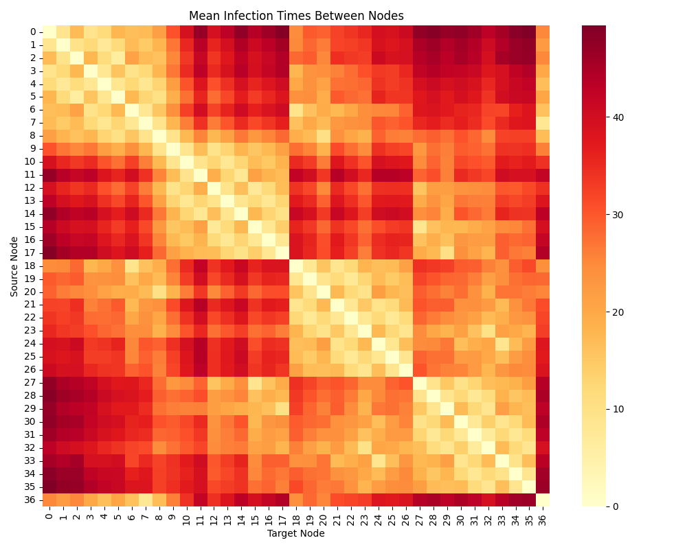
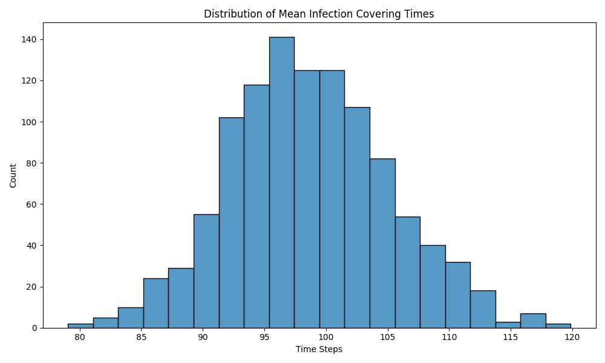
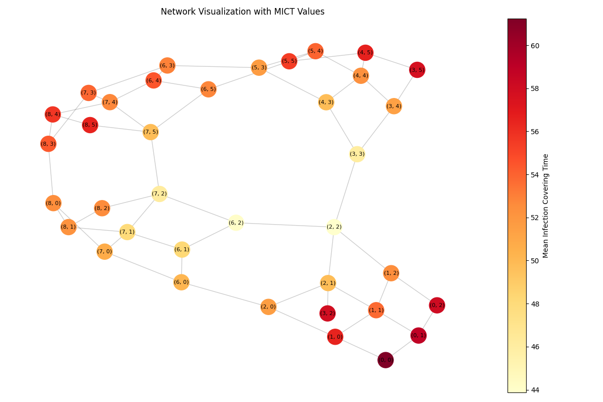

# Epidemic Network Modeling

This program implements a network-based epidemic spreading model that improves upon traditional random walk methods. It specifically addresses the limitations of single random walker models in predicting infection spread times and provides a more accurate sampling-based approach.

## Background & Strategy

Traditional epidemic models using single random walks (like PageRank) fail to accurately predict how quickly diseases spread through networks. This is because they don't account for multiple simultaneous infections - in reality, an infected person can infect multiple neighbors at once, unlike a random walker that can only move to one neighbor at a time.

The article "On the effectiveness of random walks for modeling epidemics on networks" proposes an alternative strategy that:
1. Uses geometric distributions to model infection times between connected individuals
2. Implements an efficient sampling strategy instead of costly 2ⁿ-state Markov chains
3. Computes more accurate metrics like Mean Infection Times (MIT) and Mean Infection Covering Times (MICT)

## Implementation Details

### Core Components

1. **Network Structure**
   - Uses NetworkX to represent contact networks
   - Nodes represent individuals
   - Edges represent potential infection paths
   - Supports community structures (demonstrated with a two-community test network)

2. **Infection Time Generation**
   - Uses geometric distribution with parameter β (infection probability)
   - Generates potential infection times τᵢⱼ for each edge
   - Times are symmetric (τᵢⱼ = τⱼᵢ) for undirected networks

3. **Sampling Strategy**
   - Runs multiple Monte Carlo simulations
   - For each simulation:
     - Generates new infection times
     - Computes shortest paths using these times as weights
     - Calculates infection spread metrics

### Key Metrics

1. **Mean Infection Time (MIT)**
   - Average time taken for infection to spread from node i to node j
   - Computed using weighted shortest paths
   - Visualized through heatmap:

2. **Mean Infection Covering Time (MICT)**
   - Time taken for a node to infect the entire network
   - Lower MICT = more critical node for epidemic spread
   - Distribution shown in:

3. **Network Visualization**
   - Nodes colored by their MICT values
   - Helps identify critical spreaders
   - Community structure visible in:

## Technical Implementation

The code is organized into several key classes and functions:

1. **ModelParameters**
   - Dataclass containing simulation parameters
   - Infection probability
   - Number of simulations
   - Random seed

2. **EpidemicNetworkModel**
   - Main class implementing the modeling strategy
   - Key methods:
     - `_generate_potential_infection_times()`: Creates edge infection times
     - `_compute_shortest_paths()`: Calculates infection paths
     - `_single_simulation()`: Runs one iteration of the model
     - `run_simulations()`: Executes multiple iterations and aggregates results

3. **Visualization Methods**
   - Heatmap of infection times
   - Distribution of covering times
   - Network visualization with MICT-based coloring
   - Node rankings table

## References

Kim, S., Breen, J., Dudkina, E., Poloni, F., & Crisostomi, E. (2023). On the effectiveness of random walks for modeling epidemics on networks. PLOS ONE, 18(1), e0280277.